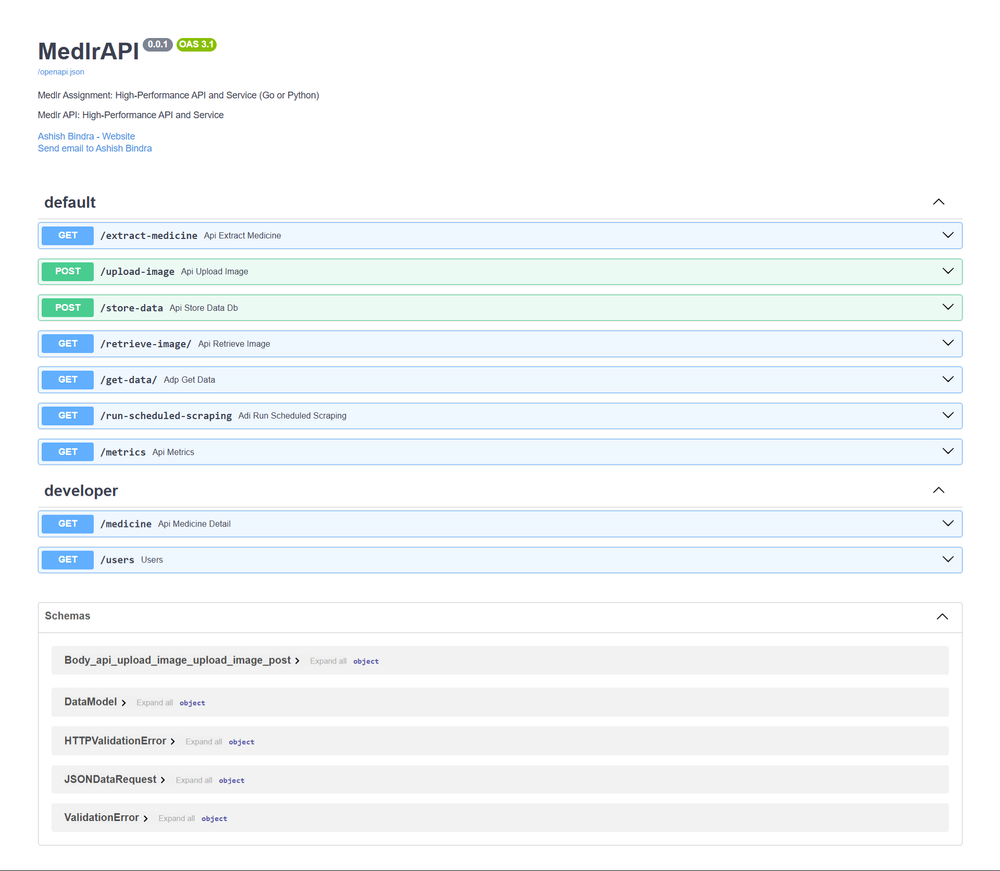
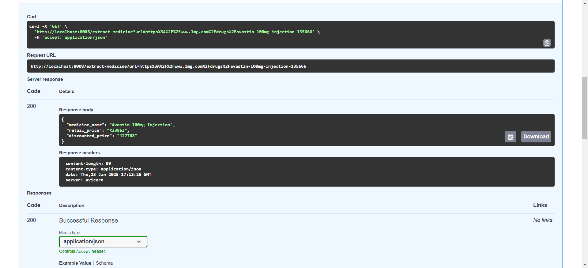
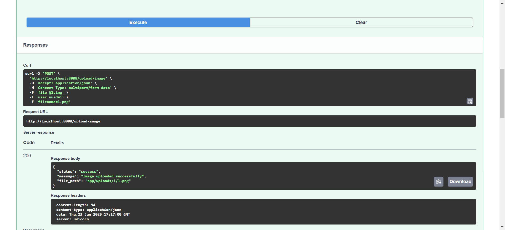
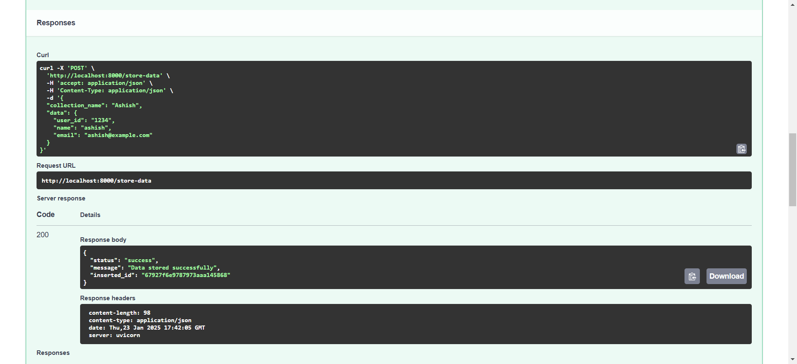
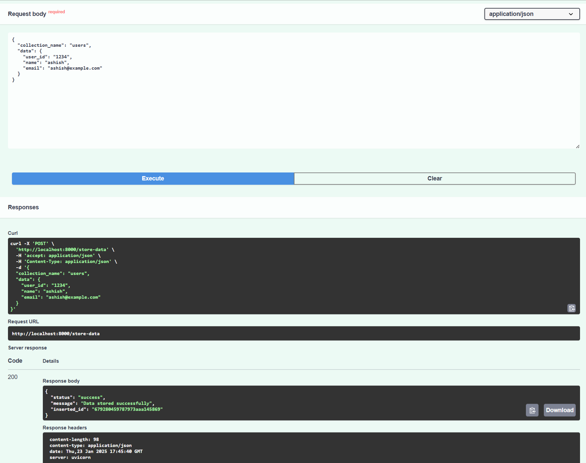
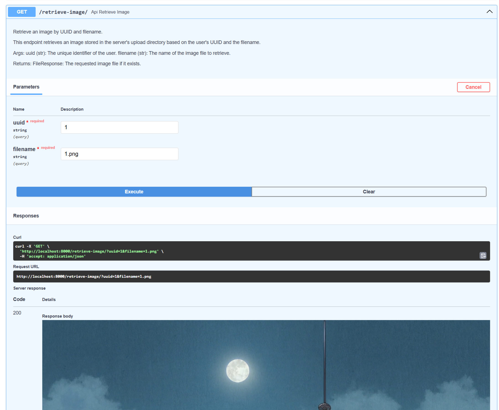
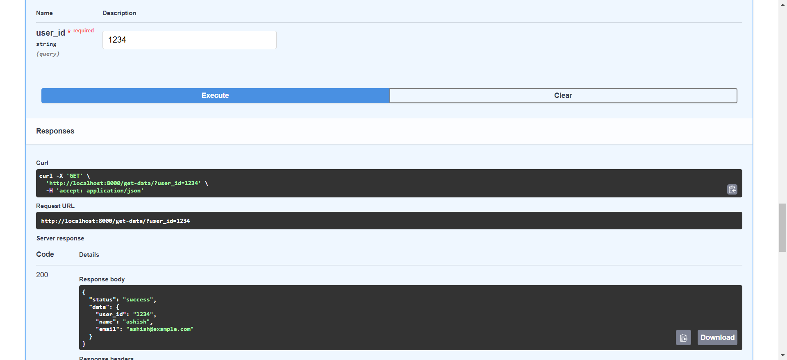

# Medlr Assignment: High-Performance API and Service

## Setup Instructions

### Prerequisites
1. Install **Docker** (optional, if using Docker for containerization).
2. Install MongoDB (local or cloud-based instance).
3. Install required dependencies for Go or Python:
   - Go: Use `go mod` to install dependencies.
   - Python: Use `pip install -r requirements.txt`.

### Running the Project
1. Clone the repository:
   ```bash
   git clone https://github.com/ashishbindra2/Medlr-Assignment.git
   cd Medlr-Assignment
   ```
2. Configure environment variables in a `.env` file:
   ```env
   MONGO_URI=mongodb://localhost:27017
   UPLOAD_FOLDER=uploads
   SCRAPER_SCHEDULE=0 0 * * *  # Example: Daily at midnight
   ```
3. Run the application:

   - **Python:**
     ```bash
     python app.py
     ```
4. Access the APIs via `http://localhost:8000/docs`.
5. Access the documentation `http://127.0.0.1:8000/redoc`
---

## Screenshots








## Objective
The purpose of this project is to implement a high-performance CRUD API in Go, Python, or both. The API will handle the following functionalities:

1. Extract medicine details from a 1mg.com URL.
2. Upload image files and associate them with a user UUID and filename.
3. Store arbitrary JSON data in a MongoDB collection.
4. Retrieve uploaded images by user UUID and filename.
5. Retrieve data from MongoDB based on a user_id.

> **Note:** Use of AI helpers (e.g., ChatGPT, Gemini) should be minimal and will be reviewed during the code review phase.

---

## Key Requirements

### Language Selection
- The API can be implemented in **Go**, **Python**, or both.
- Extra credit will be awarded for implementing solutions in both languages.

### Performance
- The API must be optimized for high concurrency and high workload environments.

### Best Practices
- Follow best practices for the chosen language, including use of suitable frameworks and libraries.
- Ensure proper error handling, input validation, and structured logging.

---

## API Details

### 1. Extract Medicine Details
**Route:** `/extract-medicine`

**Method:** `GET`

**Request Body:**
```json
{
  "url": "https://www.1mg.com/drugs/paracetamol-500mg-10-tablets-123456"
}
```

**Response:**
```json
{
  "medicine_name": "Paracetamol 500mg",
  "retail_price": 50.00,
  "discounted_price": 45.00
}
```

---

### 2. Image Upload
**Route:** `/upload-image`

**Method:** `POST`

**Request:** Accepts `multipart/form-data` with the following fields:
- `file`: The image file (must have `.img` extension).
- `user_uuid`: A unique identifier for the user.
- `filename`: The name under which the file will be stored.

**Response:**
```json
{
  "status": "success",
  "message": "Image uploaded successfully",
  "file_path": "uploads/<user_uuid>/<filename>.img"
}
```

---

### 3. Store Data in MongoDB
**Route:** `/store-data`

**Method:** `POST`

**Request Body:**
```json
{
  "collection_name": "users",
  "data": {
    "user_id": "12345",
    "name": "John Doe",
    "email": "johndoe@example.com"
  }
}
```

**Response:**
```json
{
  "status": "success",
  "message": "Data stored successfully",
  "inserted_id": "63c9f5e1d2a5e7e5b3c2a8d6"
}
```

---

### 4. Retrieve Image
**Route:** `/retrieve-image/`

**Method:** `GET`

**Response:**
- **On success:** The API serves the requested image file directly.
- **On failure:**
```json
{
  "status": "error",
  "message": "File not found"
}
```

---

### 5. Retrieve Data from MongoDB
**Route:** `/get-data/`

**Method:** `GET`

**Response:**
- **On success:**
```json
{
  "status": "success",
  "data": {
    "user_id": "12345",
    "name": "John Doe",
    "email": "johndoe@example.com"
  }
}
```

- **On failure:**
```json
{
  "status": "error",
  "message": "User data not found"
}
```

---

### 6. Scheduled URL Scraping and Database Update
**Route:** `/run-scheduled-scraping`

**Method:**
- `POST` (to trigger manually)
- Automatic scheduling via a cron job or scheduler.

**Functionality:**
1. Reads scheduled time from `.env`.
2. Fetches all `1mg.com` URLs stored in a MongoDB collection.
3. Scrapes the medicine name, retail price, and discounted price for each URL.
4. Updates the scraped data in MongoDB under the corresponding document with a timestamp.

**Note:** Ensure idempotence to avoid duplicate updates.

---

## Additional Requirements

### Concurrency & Performance
- Use concurrency features of the chosen language (e.g., goroutines in Go, `asyncio` in Python).
- Implement rate-limiting to prevent abuse.

### MongoDB Integration
- Provide instructions for setting up MongoDB (local or cloud-based).
- Use appropriate MongoDB drivers or ORMs:
  - Go: `mongo-go-driver`
  - Python: `pymongo`

### Folder Structure for Image Uploads
- Use a scalable and organized folder system to store uploaded images.

### Documentation
- Document all endpoints with example requests and responses.

---

## Bonus Features

1. Implement solutions in both **Python** and **Go**.
2. Use **Docker** for containerization.
3. Add **Swagger/OpenAPI** documentation for API endpoints.
4. Integrate structured logging (e.g., `logrus` for Go, `structlog` for Python).
5. Add observability (e.g., Prometheus and Grafana for metrics).
6. Write comprehensive **unit and integration tests** for all endpoints.

---

## Evaluation Criteria

1. **Functionality:**
   - Do all API endpoints meet the requirements?
2. **Performance:**
   - Is the API optimized for high concurrency and efficient handling of requests?
3. **Code Quality:**
   - Is the code modular, readable, and idiomatic?
4. **Error Handling:**
   - Are errors handled gracefully and reported clearly?
5. **Documentation:**
   - Are endpoints, setup process, and usage well-documented?
6. **Bonus Features:**
   - Dockerization, Swagger documentation, caching, observability.
   - Implementation in both languages for extra credit.

---
